# Getting Started

This page will give you an overview of all of the aspects of how to use Home Builder. If you are new to using Home Builder it is recommended that you start by watching a tutorial on the tutorials page, and use this page to look up information on a specific topic.

!!! note
    Even if you are a very skilled Blender user it is important to at least watch the overview video for Home Builder. Home Builder was designed to be easy-to-use even for beginners or people who have never used Blender. Assets are dragged and dropped from the Home Builder Asset library in the 3D View sidebar, and properties for these assets are accessed from the right click Prompts Interface. Using Blender Hotkeys may not work in the same way for these assets. This mainly applies to the `G` `R` `S` `X` and `Tab` hotkey commands. Use the Prompts Interface.

## Download & Installation

Home Builder is compatible with Blender 3.x and up. You can find more information about Blender [here](https://www.blender.org/).

To install Home Builder:

1. Download and Install the latest version of Blender.

    [Blender Download Page](https://www.blender.org/download/){ .md-button }

2. Download the Home Builder Add-on. This is a simple zip folder. There is NO need to extract it. We will install the zip folder directly into Blender.

    [Home Builder Download v3.0.7](https://creativedesigner3d.files.wordpress.com/2023/07/home_builder3-1.zip){ .md-button }

3. In Blender go to Edit > Preferences.

    

4. In the Add-on Tab click the `Install...` button in the top right corner.

    

5. Browse to the home_builder3.zip file you downloaded and click Install Add-on.
6. Check the box next to the Home Builder Add-on to enable it.
7. Updates are pushed using the add-on auto updater. The install might be an older version, so click the `Check now for home_builder update` button to make sure you are on the latest version.

    

## The Home Builder Library Interface

The Home Builder Interface is located in the 3D view sidebar. The sidebar can be toggled by moving your cursor over the 3D view and typing the `N` key. The library is displayed in the Home Builder tab.

The `About` button at the top of the interface opens an interface that shows you the current version, the libraries you currently have installed, and links to documentation.

!!! note
    If is recommended that you check for updates on a regular basis by clicking the `Check for Updates` button.

## Library Categories

The tabs below allow you to navigate to different library types.

* Rooms - This category allows you to draw walls, and see room information.

    

* Products - This category displays all of the product libraries. Product Libraries are assets that typically would need to be purchased or built for a room. Home Builder includes sample libraries for Cabinets, Appliances, Doors and Windows, and Bathroom Fixtures.

    

* Decorations - This category displays all of the decoration libraries. Decorations are standard Blender Objects. This category allows you to maintain your own categories of Objects that you can quickly add to the scene.

    

* Materials - This category displays all of the material libraries. These are standard Blender Materials. This category allows you to maintain your own categories of Materials that you can quickly assign to objects in the scene.

    

* Build - This category allows you to design your own products from components. 

    

## Walls

Home Builder walls are intended to give you a quick way of accurately drawing rooms. You can click points, and type in wall lengths to draw out your room. 

!!! video
    This is a video that explains everything you need to know about walls. 

    <iframe width="560" height="315" src="https://www.youtube.com/embed/74o6yJW8PtM" title="YouTube video player" frameborder="0" allow="accelerometer; autoplay; clipboard-write; encrypted-media; gyroscope; picture-in-picture; web-share" allowfullscreen></iframe>

### Drawing Walls

To activate the draw wall command click the `DRAW WALL` button in the Home Builder Sidebar. This command is available in the Rooms Category. Right below the Command you can enter in the default Wall Height and Wall Thickness.

When in the draw wall command the available commands appear in the bottom status bar.

* `Left Click` to draw wall segments.

* `Right Click` or `Esc` to finish or cancel the command.

* While drawing walls move your cursor in the direction you want to draw your wall then `type numbers` to enter in exact wall lengths.

* Hold `Ctrl` to change the angle of the wall.

* After you have drawn more than two walls you can type the `C` key to close the room. This connects the wall you are drawing with the start point of the first wall.

!!! note
    It is important to draw your rooms clockwise. Walls have an inside and outside. If you find cabinets are snapping to the wrong side then you drew the walls counter-clockwise.

    <figure markdown>
        { width="600" }
        <figcaption>This is the correct direction to draw the walls.</figcaption>
    </figure>

!!! note
    If you cancel the command while drawing walls you can select the end of the last point to continue drawing walls.

### Wall Prompts

After you have your room shape drawn you can quickly make modifications to the size of your room by right clicking and selecting `Wall Prompts`.

Here you can change the size, location, and rotation of the selected wall.

If a wall is connected to another wall you can click the `Disconnect Wall` button to disconnect it from the previous wall.

There are also commands to add a room light and a floor. These are commands to quickly add these types of elements, but you can always add your own Blender lights and floor object to the scene.

### Wall Commands

If you right click with a wall selected you will also see the wall commands menu.

* Edit Wall - This command applies all of the wall modifiers and enters edit mode. Allowing you to change the shape of the wall using Blenders modeling commands.

    !!! note
        Once you Edit the wall shape you will now be able to change the size of the room using the prompts interface.

* Add Wall Length Dimension - This commands adds a dimension annotation to the wall that displays in the 3D environment.

* Delete Wall - This commands deletes the active wall and all other selected walls. 

    !!! note
        It is important to use this command and not Blenders default delete command. Since there are several objects that make up the wall command, if you use the Home Builder Delete Wall command this will correctly remove all references to the wall including any doors, window, or cabinets that have been placed on the wall.

### Understanding the Wall Object

A wall is an Assembly. This is the basic building block of all Home Builder Assets. It is a group of objects that are structured in a specific way. You can think of it as a container for all of the products assigned to that wall. 

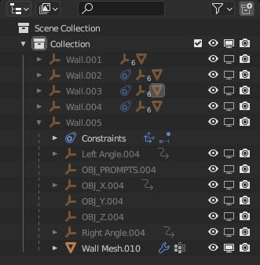

Each wall is listed separately and if you drop down the hierarchy you will find the wall consists of:

* Base Point - This is an empty object that contains the base point of all other objects.

* Mesh - This is the physical representation of the wall.

* X, Y, Z Object - These control the size of the wall.

* Other Empties - There are several other empty objects that control the prompts and miters for the walls.

* Other Assemblies - As you add other assets like doors, windows, and cabinets to walls they will be nested inside of that wall assembly.

### Assigning Materials to Walls

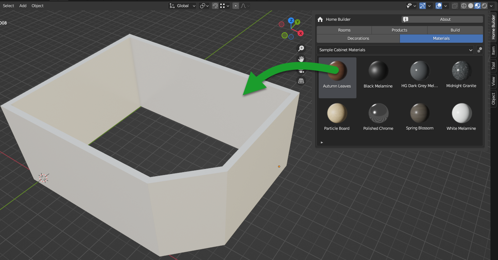

You can assign materials to the wall by dragging and dropping materials from the material library to the wall mesh. This will open an interface that allows you to assign them to the individual wall, or to the wall pointer which will update all walls in the scene.

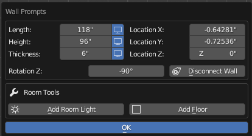

* Override All - This updates all of the slots for this one object.

* Override - This updates the specific material slot it is inline with.

* Update All - This updates all of the material slots that use the pointer name "Walls"

## Products

Products are assets that typically need to be purchased or built for the room. 

!!! note
    "Purchased" and "Built" refers to the idea that the person who is designing this space will need to purchase these items from a manufacturer or reseller of the product. For example if you are renovating a kitchen the client will need to buy cabinets and appliances for the renovation. Home Builder is being developed with the functionality to generating manufacturing data of the products in the scene. This is not available in the sample library, but it is possible to get cutlists, g-code, and pricing information from any assets that is placed from the product library.  

You can change the active product library using the drop down. The drop down next to the product library will open the active product library settings. This will be different for each library. 

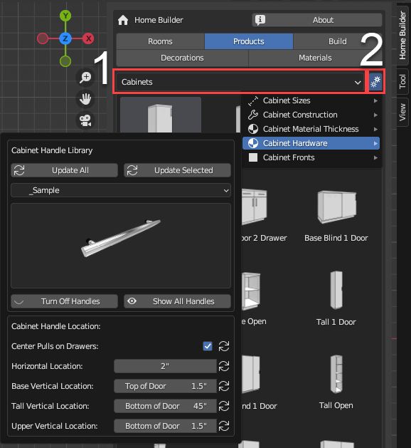

1. The drop down menu to the left allows you to switch between different product libraries.
2. The drop down menu to the right shows to the library settings for the selected library. This will be different for each library.

### Placing Products

These assets are typically dragged and dropped onto a wall or the floor. They interact with other products in the scene so they snap together in a logical way. Review the documentation for each library to understand how each of the sample libraries work.

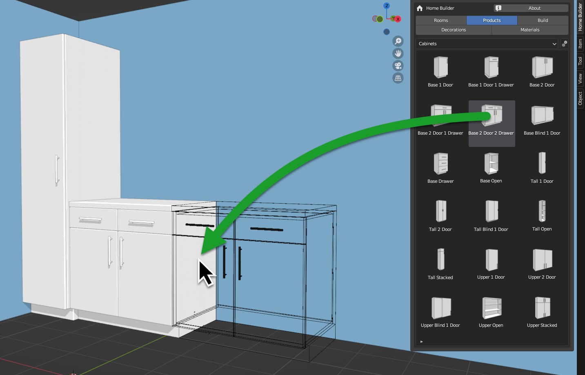

### Product Prompts

Just like walls each product has its own prompts interface that can be accessed by right click with a part of the product selected.

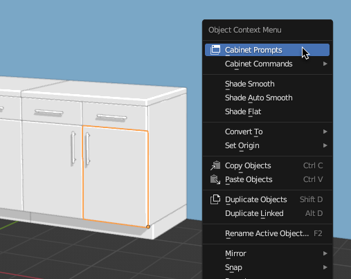

### Product Commands

Just like walls each product has its own commands menu that can be accessed by right click with a part of the product selected. These commands are typically used to access duplicate, delete, and other commands to manipulate that specific type of asset.

## Decorations

The Decorations library is a library of standard Blender objects that can quickly be added to the scene.

You can switch between the different categories by using the drop down.

You can place assets from the library by dragging and dropping them into the scene. They will snap to mesh faces and will match the rotation of any Home Builder wall that you drag them onto.

### Saving Your Own Decorations to the Library

You can save any Blender object to this library. By selecting the object you want to save, then selecting the `Save Selected Object to Library` Command from the Decoration Library Settings Menu.

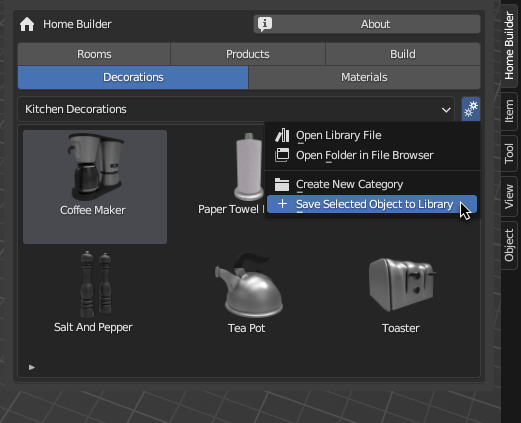

If you want to save multiple objects as one asset to the library you need to parent all of the objects to one object then save the base point. When saving the asset the confirmation dialog will ask you if you want to save the child objects as well. Turn this on and click OK.

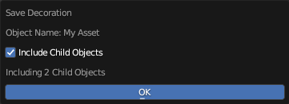

!!! note
    It is a good idea to create an external library package for your custom assets. This makes it so they don't get overwritten when you update and you can easily distribute them to other users. View the Section on [Creating External Libraries](04_library_development.md#creating-external-decoration-and-material-libraries) for further details.

## Materials

The Materials library is a library of standard Blender materials that can quickly be added to objects in the scene.

You can switch between the different categories by using the drop down.

You can place materials from the library by dragging and dropping them into the scene then selecting an object to assign them to. When placing materials on an object with multiple material slots a dialog will appear and allow you to assign them to individual material slots, or update a material pointer that is assigned to all of the objects in the scene.

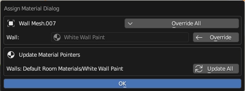

* Override All - This updates all of the slots for this one object.

* Override - This updates the specific material slot it is inline with.

* Update All - This updates all of the material slots that use the pointer name that slot is assigned.

### Saving Your Own Materials to the Library

You can save any Blender materials to this library. By selecting the object that the material is assigned and selecting the material in the object material properties interface. 

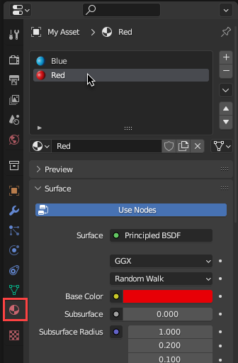

Then select `Save Active Material to Library` command in the Material Library Settings Menu.

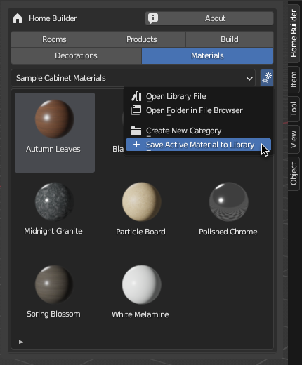

!!! note
    It is a good idea to create an external library package for your custom assets. This makes it so they don't get overwritten when you update and you can easily distribute them to other users. View the Section on [Creating External Libraries](04_library_development.md#creating-external-decoration-and-material-libraries) for further details.

## Build Library

The Build library is intended to allow you to design your own custom products. After snapping different starters, inserts, and parts together you can save your product to the user library where you can reuse your custom products in future projects. This works great for custom islands, custom closet configurations, and other custom cabinets. 

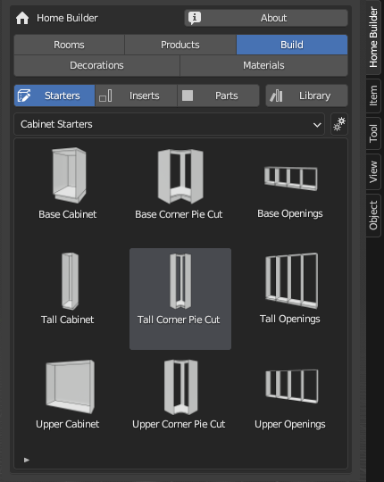

### Starters

The Starters Library typically contains starter components for creating new products. These starter components also typically have openings that inserts and parts can be dropped into.

### Inserts

The Inserts Library typically contains components that can be dropped into openings. If you are using the cabinet library you will notice that you can drop items like shelves, doors, and drawers into openings. After dropping an insert into an opening the insert will remain parametric and always match the opening size.

### Parts

The Parts Library typically contains individual parts that can be dropped onto a starter or into an opening depending on the parts. Each part may have it's own drop functionality to determine the best way it should be placed into the scene.

### User Library

The User Library contains your own custom products or assemblies that you created. You can create new categories and save your assets to these categories.

You can create new categories in the build library settings drop down. By selecting the `Create New Category` button.

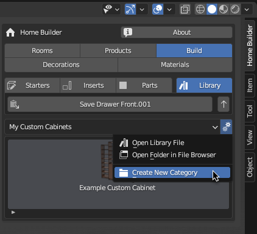

After creating a new category you can save an assembly by using the button above the category drop down. The button name will display the current Assembly you have selected. The button to the right selects the parent assembly. If you want to save the top level assembly keep clicking that button until it is disabled.

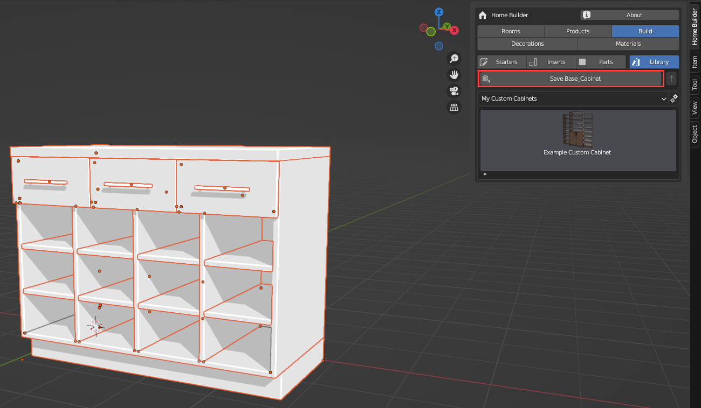

You will notice all parts that are part of that assembly will be highlighted in the 3D Viewport.