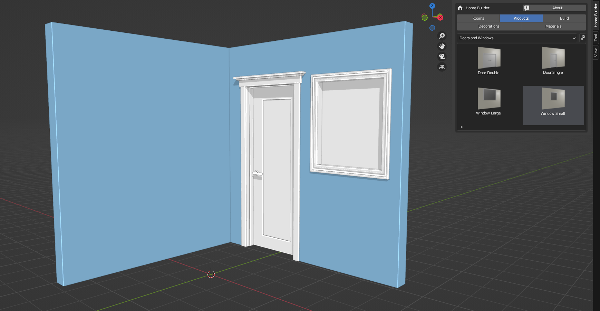
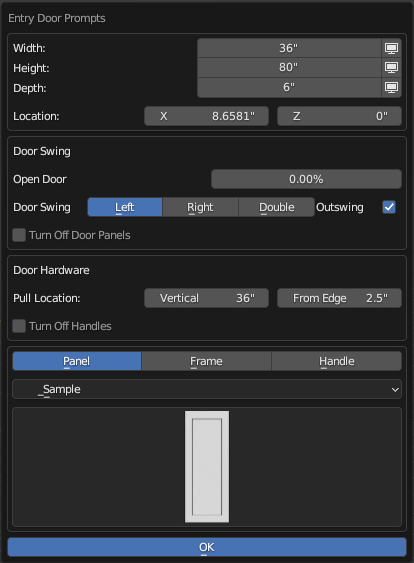

# Sample Library Data

Home Builder come with a set of sample library data this page will explain all of the options available for each Product Library.

!!! note
    For more information on products review the [Products Section on the Getting Started Page](01_getting_started/#products).

## Entry Door and Window Library

This library consists of:

* Door Double
* Door Single
* Window Large
* Window Small

### Drag and Drop Functionality

Doors and Windows are intended to be placed on walls. Drag them from the library and left click on the wall you want to place them on.

### Entry Door Prompts UI

Entry Door Prompts display all of the properties for the doors.

* Width, Height, Depth - These properties change the size of the door.
* Location X, Z - The X Location is the location from the left side of the wall to the left side of the door frame. The Z Location is the distance from the bottom of the wall to the bottom of the door frame. This will typically be 0.
* Open Door - This value opens the door. 
* Door Swing - This changes the door swing.
* Out Swing - This determines if the door swings into the room or outside of the room.
* Turn Off Door Panels - This allows you to turn off the door panels. If you just want an opening with no door panels turn this option on. YOu may also want to turn on the Turn Off Handles option.
* Pull Location Vertical - This sets the location from the bottom of the door panel to the location where the handle is located.
* Pull Location From Edge - This sets the horizontal location from the edge of the door to the where the handle is located.
* Panel, Frame, and Handle Selection - This sets the components used for the selected door. The category above the thumbnail allows you to switch between different categories. The Home Builder Pro Library has a lot more options. If you select the thumbnail you will see a list of all of the available selections. Click on the thumbnail to swap out the component that is used.

!!! warning
    I am still working on the rest of the documentation for this page. Check back soon for more information.
    
### Window Prompts UI

### Door and Window Commands

### Library Settings UI

## Cabinet Library

### Drag and Drop Functionality

### Entry Door Prompts UI

### Window Prompts UI

### Door and Window Commands

### Library Settings UI

## Appliance Library

### Drag and Drop Functionality

### Entry Door Prompts UI

### Window Prompts UI

### Door and Window Commands

### Library Settings UI

## Bathroom Fixtures

### Drag and Drop Functionality

### Entry Door Prompts UI

### Window Prompts UI

### Door and Window Commands

### Library Settings UI