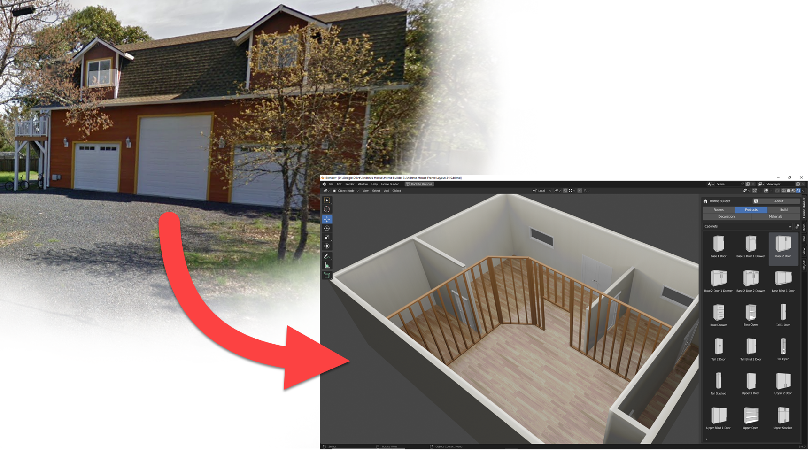
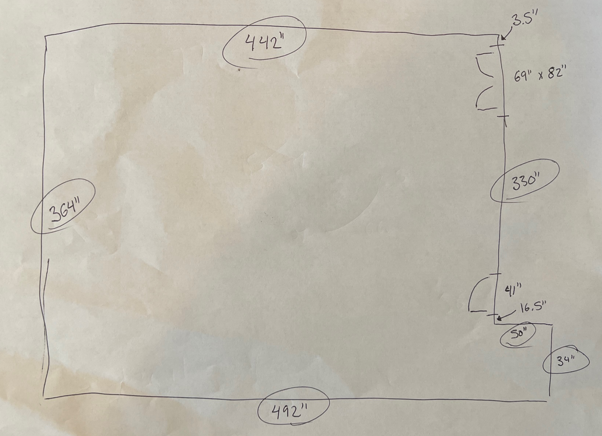
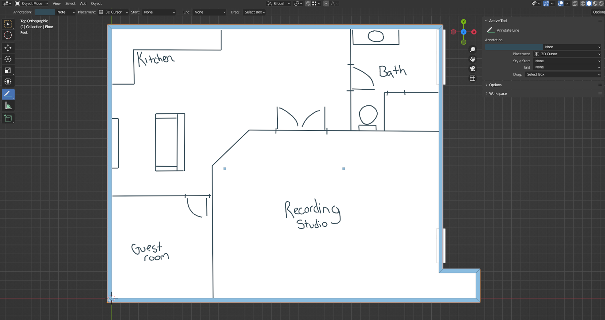
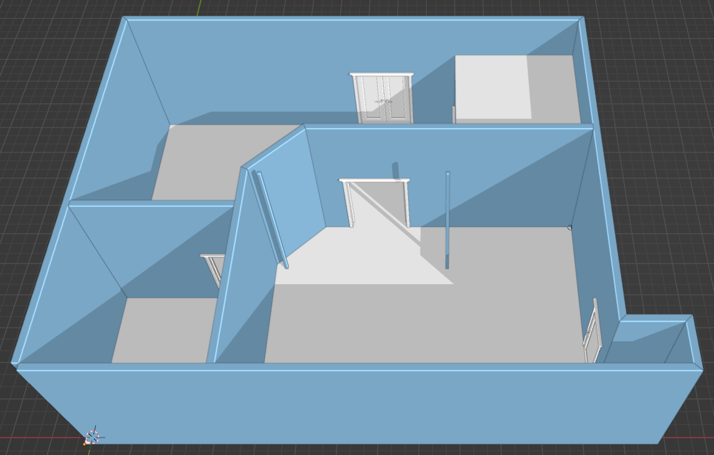
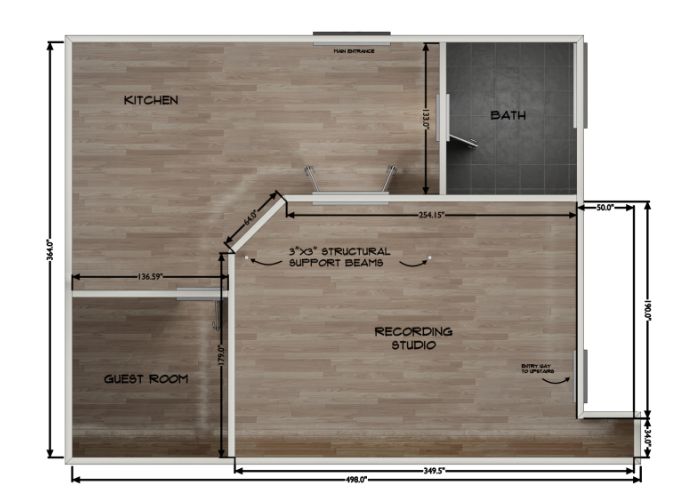

# Tutorial: Design Your Own Home Remodel

Using Blender and the Home Builder Add-on, you can design your own home remodel for free.

## Introduction to the Project

I will be using my own home remodel to teach you the process.

I live in a barn style home. On the first floor there is a large three car garage. So this is just a big open area and where my remodel is going to take place. The second floor contains the living space which has two bedrooms, one bath, and a kitchen.

The goal of my remodel is to add a recording studio, bathroom, kitchen, and guest room in the 3 car garage.

## Overview of Steps

We are going to start by standing in our physical room, drawing a picture of the shape of the room, and getting dimensions of each of the walls.

!!! note
    As you can see this doesn't need to be a pretty picture. Just draw something that you understand, and take measurements using a tape measure or some kind of measuring tool.  

We are going to use this image to draw the walls and place doors and windows in 3D using Home Builder.

When we finish drawing our original walls and adding the doors and windows we are going to use the grease pencil tool to sketch out different possibilities. This allows us to quickly iterate through different designs without taking the time to enter in exact dimensions.

After we have a design we like we are going to accurately draw the additional walls, and add interior doors using Home Builder.

Then we are going to create material pointers for each room to allow us to easily switch out the wall and floor materials for each room. 

Now that the overall structure of our design is finished we are going to create a 2D Plan view with dimensions that we can provide to a contractor.

!!! warning
    I am still working on the rest of the documentation for this page. Part One of this tutorial series will be released soon.
