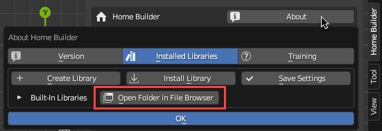
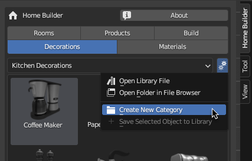
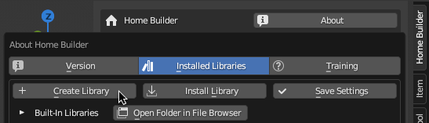
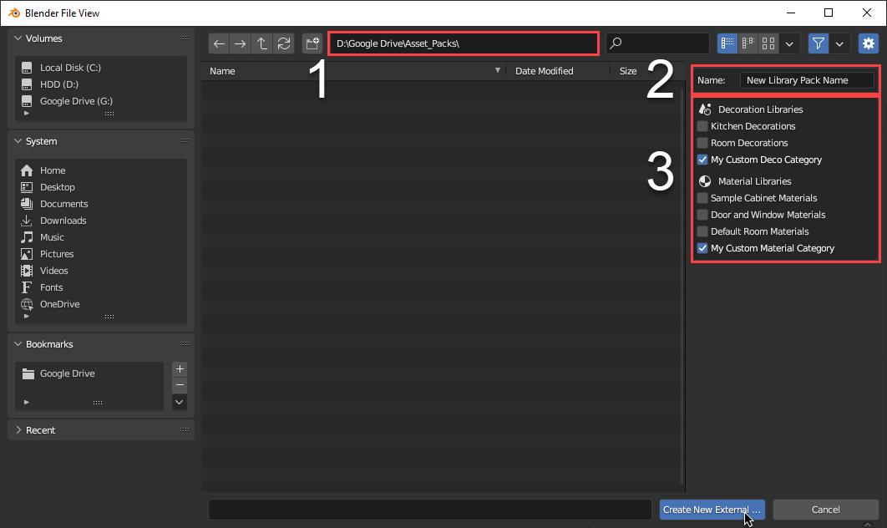
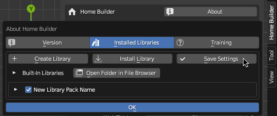

# Library Development

Home Builder comes with a set of libraries that can be used to design a wide variety of kitchen, bath, and closet spaces. These libraries can also be used to learn how to create your own libraries. 

## Built-In Library Location

These are located in the home_builder add-on folder. You can easily access this directory in the `About` Interface. In the `Installed Libraries` tab click the `Open Folder In File Browser` button.



## External Libraries

If you want to maintain your own libraries it is important to install them as an external library.

!!! note
    Since Home Builder uses the auto add-on updater if you don't save your custom libraries externally they will removed when you run an update.

## Creating External Decoration and Material Libraries

Creating external decoration and material libraries are basic assets, and are easier to create than product libraries. 

### Step One: Create Your Own Categories and Save Your Assets

Use the `Create New Category` command in the library setttings menu for the Decoration and Material Library. This will create a new empty folder that you can save assets to. Save all of the assets you want to these new categories.



### Step Two: Create a Library Package From Your Custom Categories

After you have saved all of your assets to new categories you need to create a library package. This will export all of the custom categories to an external  directory outside of the add-on.

In the `Installed Libraries` tab in the `About` interface click `Create Library`



An Interface will open where you can set the location where you want to save your external library, add a name for the library package you are creating, and select the libraries you want to include.



1. This is the path where you are going to save the library package to. This should be outside of the home builder add-on directory.
2. This is the name of the library package that you are creating. This name will be used as the folder name that is created and the name that displays in the `Installed Libraries` interface.
3. This is the list of the libraries that are currently available. Check the boxes that you want to add to your library package.

After you have set the path, entered in a name, and selected your libraries click the `Create New External...` button at the bottom of the interface.

### Step Three: Save Settings and Remove the Duplicate libaries

Now that you have created a new library package you will see your new library in the `Installed Libraries` interface. Click the `Save Settings` button so the new library will automatically show up when you restart Blender.



!!! note
    You will see duplicated categories in the library. All you need to do is delete the original libraries in the built in home builder library. If you click the `Open Folder in File Browser` the path to the built in libraries will be opened in your default browser. You can navigate to the `decorations` or `materials` category and delete your custom categories. After restarting Blender you will see your new categories that are loaded from your new external library.

## Developing Product Libraries

Product libraries are very customizable. You can look at the sample library data including the Cabinets, Appliances, Doors and Windows, and Bathroom Fixtures to see what is possible.

Developing new product libraries requires python programming, and an understanding of the Blender Python API. Product libraries allow you to create a library that is much more customizable than decorations. This includes:

* Parametric Library Assets - Parametric assets can be any models that can change size in a logical way, and provide users a number of custom properties to change various options for your assets. 
* Custom Prompt Interface - When right clicking with a product asset selected, users can access the prompts page which can include any information you want to provied to the user.
* Custom Asset Commands - When right clicking with a product asset selected, users can access commands that allow them to interact with products with custom commands.
* Custom Drop Functionality - When dragging and dropping a product from the library you can define how these assets snap together giving users an easy way of placing products from the library.
* Custom Library Settings UI - You might have custom options that change information about the product assets. This UI is shown to the right of the library category.
* Reports that Extract Data Rrom Your Parametric Assets - One of the big reasons of devloping a product library is to be able to extract specific information from your products. This can include reports that display pricing information for your products, cutlists, or product detail reports.


### The Product Library Structure

Product libraries are registered in a python package. A python package is just a folder that contains an `__init__.py` file.

The `__init__.py` implements a list variable called LIBRARIES which contains dictaries with key words to tell home builder how to use and register this library.

The `__init__.py` also contains a register function which is called on startup to register all of the Blender operators, and ui elements used in the library.

An simple example of an `__init__.py` file would be as follows.

``` py
import os
from . import my_custom_blender_operators
from . import my_custom_blender_ui

#This is the path to where the blender assets are stored. This is used to display
#The assets in the 3D View Sidebar
MY_LIBRARY_PATH = os.path.join(os.path.dirname(__file__),'library',"My Custom Library")

#This is a dictionary that implements all of the keys that home builder uses to 
#determine how the library should work.
MY_LIBRARY = {"library_name": "My Custom Library",
              "library_type": "PRODUCTS",
              "library_path": MY_LIBRARY_PATH,
              "library_menu_id": "MY_CUSTOM_LIBRARY_MT_library_settings",
              "library_activate_id": "my_custom_library.click_asset",
              "libary_drop_id": "my_custom_library.drop_asset"}

#This is a list variable that stores all of the dictionaries of libraries for Home Builder 
#to implement. You can register as many libraries as you want. Each Library is displayed as
#it's own category in the library.
LIBRARIES = [MY_LIBRARY]

#This is called on startup and registers all of the Blender Types that are used in the library.
#Each of these modules implement their own register function that registers all of the operators
#and UI elements needed for the library.
def register():
    my_custom_blender_operators.register()
    my_custom_blender_ui.register()
```

As you can see the MY_LIBRARY dictory implement these keys:

* __library_name__ - This is the library name that is displayed in the Interface.
* __library_type__ - This is the type of library to register. While it is common this will be in the PRODUCTS library you can register libraries for {'PRODUCTS' , 'STARTERS' , 'INSERTS' , 'PARTS' , 'BUILD_LIBRARY' , 'DECORATIONS' , 'MATERIALS'}
* __library_path__ - This is the path where Home Builder should look for the .blend file where the assets are stored. These are the assets that are displayed in the Home Builder Asset Browser.
* __library_menu_id__ - This is the class name of the Blender Menu that is displayed to the right of the library category. You can add any library settings into this interface.
* __library_activate_id__ - This is the bl_id of the operator that is used when clicking on an asset in the asset browser. This doesn't need to be implement all of Home Builders libraries just use the drop_id, but this was added just in case a library needed an event to trigger when an asset is simply clicked.
* __library_drop_id__ - This is the bl_id of the operator that is used when dragging an asset in the asset browser. This is typically a modal operator that handles building or retriving the asset and determining how the asset should be placed in the scene. These operators can be difficult to implement since there is so much flexibility. It is recommended to review Blenders Documentation and exsisting Home Builder operators to see how these work.

!!! note
    This is a big topic. The information here doesn't even scratch the surface on what is possible. I will create tutorials and more information on how to develop libraries for Home Builder soon. Check back soon for more information.